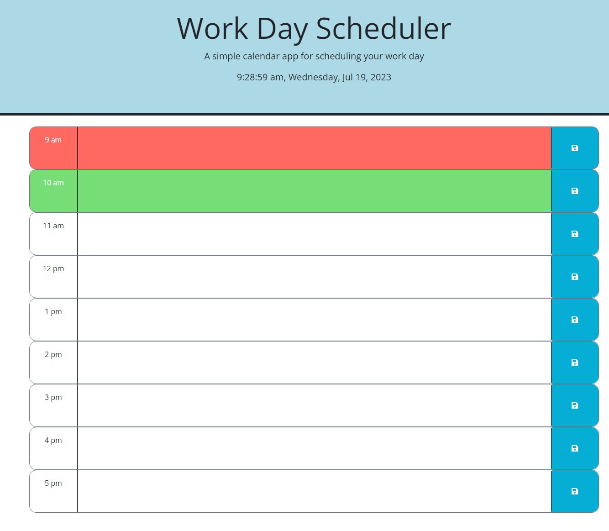
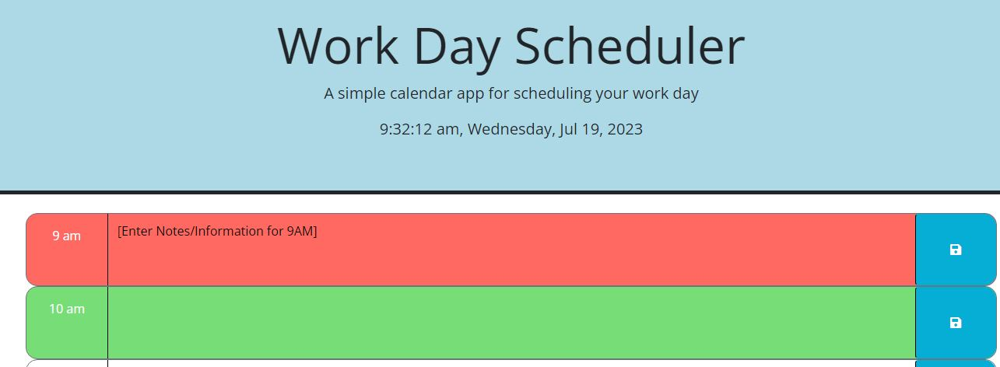

# DT-Third-Party-API-Challenge

This Project is to showcase the functionality of displaying a dynamic work day schedule.

When you launched the website, there are a few things that will be displayed:
  1. Current time will be displayed with the to the very second in your timezone
 2. Color coding will be applied to highlight the specified timeslot you will be partaking
 a. Maroon (red) = showcases the current hour timeslot
 b. light green = showcases the next hour
 c. gray = showcases the previous hour

The next neat thing about its functionality is being able to save text.
 
 For example, let's say if you wanted to add notes or simply add more information to that designated timeslot.
 You would first enter the text in the box to the right of the hour clock

 From there simply click on the save Icon to the right of the text box and presto! It is now saved
 Even if you refresh the page now, that information is stored to your local storage to reference at your own convenience.
 
  Deployed Link: https://dtrieu1.github.io/DT-Third-Party-API-Challenge/
